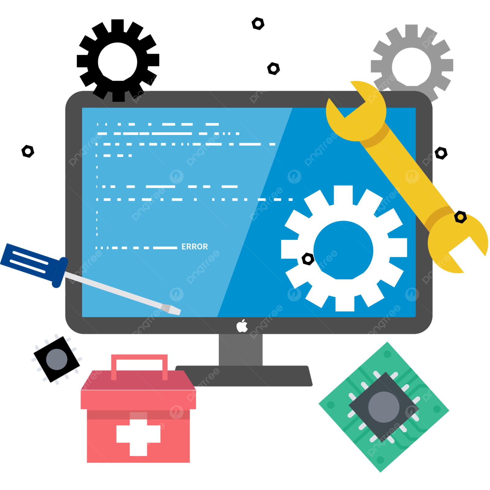

#  Proyecto Intermodular 1º DAW 2024/2025  

## Servicio de Reparaciones Informáticas

###  Descripción General

Este proyecto tiene como objetivo **crear una empresa de servicios de reparación informática** que incluye:

- Desarrollo de una **aplicación de gestión integral** del servicio técnico.
- Diseño de una **web corporativa**.
- **Instalación informática** que dé soporte a la empresa.

---

###  Objetivos del Proyecto

- Crear una aplicación intuitiva y eficiente para gestionar un taller de reparaciones.
- Integrar todos los procesos desde la recepción del equipo hasta su devolución.
- Mejorar la trazabilidad y eficiencia en la gestión de recursos.
- Facilitar la toma de decisiones mediante herramientas analíticas.
- Diseñar una infraestructura informática adecuada.
- Desarrollar una aplicación web.

---
## 👥 Equipo

Este proyecto fue desarrollado por:

- Ana Pérez
- Juan García
- Luisa Fernández
- Carlos Soto

---
###  Subsistemas del Proyecto

#### 1. Gestión de Materiales
**Objetivo:** Controlar inventario de piezas y repuestos.  
**Funcionalidades:**
- Registro y control de stock.
- Alertas por bajo stock.
- Gestión de proveedores y compras.
- Asignación de materiales a reparaciones.
- Historial y coste de materiales.

---

#### 2. Gestión de Personal
**Objetivo:** Administrar al equipo técnico.  
**Funcionalidades:**
- Registro de empleados y sus especialidades.
- Gestión de turnos y horarios.
- Asignación de tareas.
- Evaluación de desempeño.

---

#### 3. Gestión de Reparaciones
**Objetivo:** Seguimiento de cada reparación desde el ingreso hasta la entrega.  
**Funcionalidades:**
- Registro del problema, diagnóstico y equipo.
- Asignación de técnicos y materiales.
- Seguimiento de estado (en espera, en proceso, completada).
- Estimación de costes y tiempos.
- Informes por cliente y tipo de reparación.

---

#### 4. Gestión de Clientes
**Objetivo:** Administración de personas y empresas que solicitan servicios.  
**Funcionalidades:**
- Registro de datos del cliente.
- Historial de reparaciones.
- Presupuestos personalizados.
- Notificaciones de estado.
- Clasificación de clientes.

---

#### 5. Generación de Informes
**Objetivo:** Seguimiento y análisis del negocio.  
**Funcionalidades:**
- Informes financieros.
- Control de inventario.
- Rendimiento del personal.
- Satisfacción del cliente.
- Exportación (PDF/Excel) e importación de datos.

---

###  Requisitos del Sistema

- **Interfaz Gráfica Amigable (GUI)**
- **Base de datos relacional** (ej. MySQL)
- **Sistema de autenticación** y control de acceso
- **Documentación técnica y guía de usuario**

---

###  Requisitos del Proyecto

- Cumplimiento con todos los módulos del proyecto intermodular.
- Instrucciones del profesorado y del *product owner*.

---

###  Alcance del Proyecto

- Dirigido a talleres pequeños y medianas empresas.

